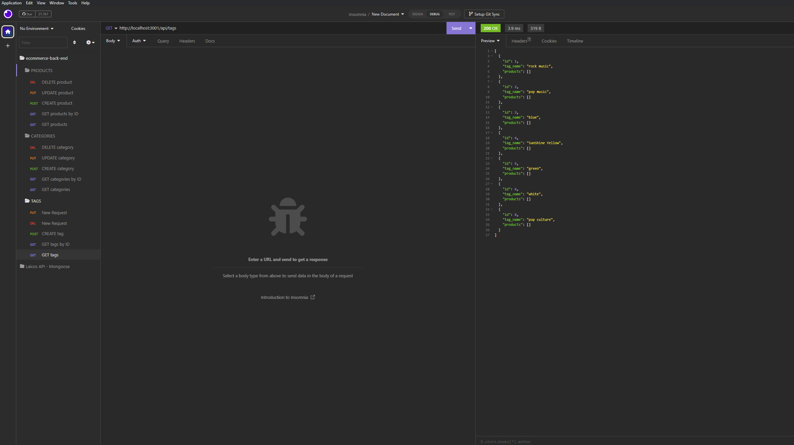

# E-commerce Back End
This project was started with some code from our UofU Bootcamp and was finished by implementing routes and models for our application to work. <br>

## User Story
```md
AS A manager at an internet retail company
I WANT a back end for my e-commerce website that uses the latest technologies
SO THAT my company can compete with other e-commerce companies
```
## Acceptance Criteria
```md
GIVEN a functional Express.js API
WHEN I add my database name, MySQL username, and MySQL password to an environment variable file
THEN I am able to connect to a database using Sequelize
WHEN I enter schema and seed commands
THEN a development database is created and is seeded with test data
WHEN I enter the command to invoke the application
THEN my server is started and the Sequelize models are synced to the MySQL database
WHEN I open API GET routes in Insomnia Core for categories, products, or tags
THEN the data for each of these routes is displayed in a formatted JSON
WHEN I test API POST, PUT, and DELETE routes in Insomnia Core
THEN I am able to successfully create, update, and delete data in my database
```
***
This application was not deployed, but instead was tested in Insomnia and shown in a [walkthrough-video](https://drive.google.com/file/d/1afivHIK-w4X8zUUh3QzLq7Vhl1pHdX4n/view). You can use Insomnia to test the following routes:

```md
- GET: get all products, categories, and tags by single ID or all at once.
- POST: create new products, categories, or tags.
- PUT: update products, categories, or tags by ID's.
- DELETE: delete products, categories, or tags by ID's.
```

***

## License

Please refer to the license in the repository.

### Thank you!